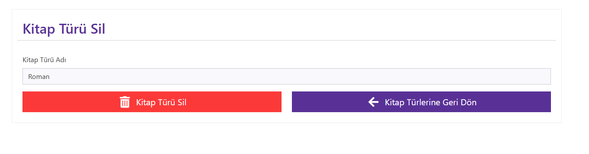
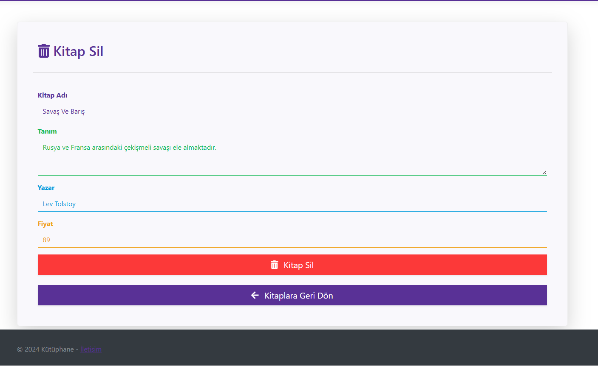

# Kutuphane

1. [Kayıt Ol](images/KayitOl.png)

2. [Kayıt Onayı](images/KayitOnayi.png)

3. [E-posta Onayla](images/EpostaOnayla.png)

4. [Giriş Yap](images/GirisYap.png)

5. [Profil](images/Profil.png)

6. [Kategori](images/KitapTuru.png)

7. [Kitap Türü Ekle](images/KitapTuruEkle.png)

8. [Kitap Türü Güncelle](images/KitapTuruGuncelle.png)

9. [Kitap Türü Sil](images/KitapTuruSil.png)

10. [Kitap İşlemleri](images/Kitapİslemleri.png)

11. [Kitap İslemleri Kitap Ekle](images/KitapIslemleriKitapEkle.png)

12. [Kitap İslemleri Kitap Güncelle](images/KitapIslemleriKitapGuncelle.png)

13. [Kitap İslemleri Kitap Sil](images/KitapIslemleriKitapSil.png)

14. [Kitap Kiralama](images/KitapKiralama.png)

15. [Kiralama Ekle](images/KiralamaEkle.png)

16. [Kiralama Güncelle](images/KiralamaGuncelle.png)

17. [Kiralama Sil](images/KiralamaSil.png)

